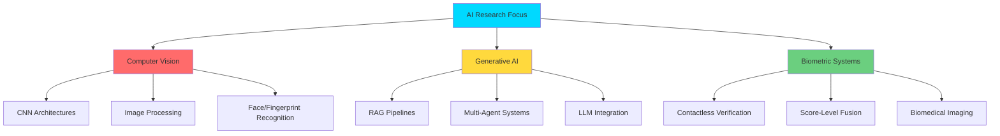

<div align="center">
  
# ✨ Yash Lomate ✨

### 🧠 AI Researcher | Computer Vision Engineer | Generative AI Specialist

**MS in Artificial Intelligence @ Northeastern University (3.8 GPA)**

[](YOUR_LINKEDIN_URL)
[](mailto:lomate.y@northeastern.edu)
[](YOUR_PAPER_LINK)

</div>

---

## 👨‍💻 About Me
```python
class AIResearcher:
    def __init__(self):
        self.name = "Yash Lomate"
        self.education = "MS in AI @ Northeastern University (GPA: 3.8)"
        self.research_interests = [
            "Computer Vision & Biometric Systems",
            "Generative AI & RAG Pipelines", 
            "Deep Learning for Medical Imaging"
        ]
        self.current_focus = [
            "🔬 CNN-based Biometric Verification (93.75% accuracy)",
            "🤖 Multi-Agent AI with LangChain & OpenAI",
            "🧬 RAG Systems for Knowledge Management"
        ]
        
    def seeking(self):
        return ["AI Research", "ML Engineering", 
                "Computer Vision", "Biomedical Imaging"]
```

🎯 **What I Do:**
- 🔬 Published researcher in **CNN-based biometric systems**
- 🧠 Design and fine-tune **Generative AI & RAG models** (TensorFlow, PyTorch, OpenAI APIs)
- 👁️ Build **computer vision applications** (face verification, fingerprint analysis, image processing)
- 🤖 Architect **multi-agent AI systems** processing 10K+ daily transactions
- 📊 Deploy **end-to-end ML pipelines** with Azure and MLflow

---

## 🛠️ Tech Stack

### 🧠 Deep Learning & Computer Vision


### 🤖 Generative AI & LLMs


### ☁️ Cloud & MLOps


### 💾 Additional Skills


---

## 📊 GitHub Analytics

<div align="center">
  


</div>

---

## 🔬 Research & Publications

<table>
<tr>
<td width="70%">

### 📄 "Contactless Fingerprint Verification Using CNN"
**Published in:** International Journal of Scientific Research and Engineering Development (IJSRED)

**Key Contributions:**
- Engineered hybrid CNN-based biometric verification system
- Integrated Bezier-surface modeling with score-level fusion
- Achieved **93.75% verification accuracy**
- Enhanced matching efficiency and system reliability

</td>
<td width="30%">


</td>
</tr>
</table>

---

## 🏆 Featured Projects

<table>
<tr>
<td width="50%">

### 🔐 Face Verification using OpenAI
**Tech:** OpenAI Vision Models, Face Embeddings

✨ **Highlights:**
- **97% authentication accuracy**
- Sub-second processing time
- Secure contactless identity verification

[View Repository →](YOUR_PROJECT_LINK)

</td>
<td width="50%">

### 🖼️ Image Mosaic Reconstruction
**Tech:** Python, NumPy, Gradio

✨ **Highlights:**
- **32× faster** with vectorized NumPy operations
- Real-time Gradio interface
- Evaluated with MSE/SSIM metrics

[View Repository →](YOUR_PROJECT_LINK)

</td>
</tr>
<tr>
<td width="50%">

### 👆 Contactless Fingerprint Verification
**Tech:** CNNs, Bezier Surfaces, TensorFlow

✨ **Highlights:**
- **93.75% accuracy** in hybrid verification
- Score-level fusion of CNN + minutiae descriptors
- Published research paper

[View Repository →](YOUR_PROJECT_LINK)

</td>
<td width="50%">

### 🤖 RAG-Powered Data Analytics System
**Tech:** LangChain, OpenAI, Vector DBs

✨ **Highlights:**
- Processed **10K+ daily transactions**
- Multi-agent AI orchestration
- NLP chatbot integration

[View Repository →](YOUR_PROJECT_LINK)

</td>
</tr>
</table>

---

## 🎯 Areas of Expertise


---

## 📈 2026 Goals & Learning Path

🎓 **Current Academic Focus** (Northeastern University):
- Applied Programming & Data Processing for AI
- Advanced Algorithms for ML Systems

🔬 **Research Interests:**
- Deep learning for **biomedical imaging**
- Transformer architectures for **computer vision**
- Multi-modal AI systems
- Federated learning for **biometric privacy**

🚀 **Professional Development:**
- Contribute to open-source CV/ML projects
- Publish second research paper
- Build production-grade MLOps pipelines
- Explore **Graph Neural Networks** (GNNs)

---

## 📬 Let's Connect!

<div align="center">

[](YOUR_LINKEDIN_URL)
[](mailto:lomate.y@northeastern.edu)
[](https://github.com/yash-lomate)
[](YOUR_PORTFOLIO_URL)

### 💡 Open to Research Collaborations | AI/ML Roles | Computer Vision Projects

**Seeking:** AI Research · ML Engineering · Computer Vision · Biomedical Imaging

</div>

---

<div align="center">

### ⭐ If my work interests you, consider starring my repositories! ⭐


*"Research is formalized curiosity. It is poking and prying with a purpose." - Zora Neale Hurston*

</div>
